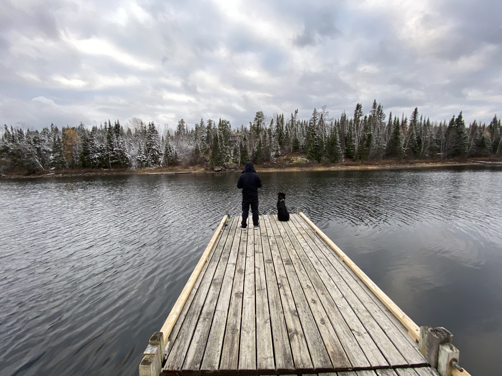
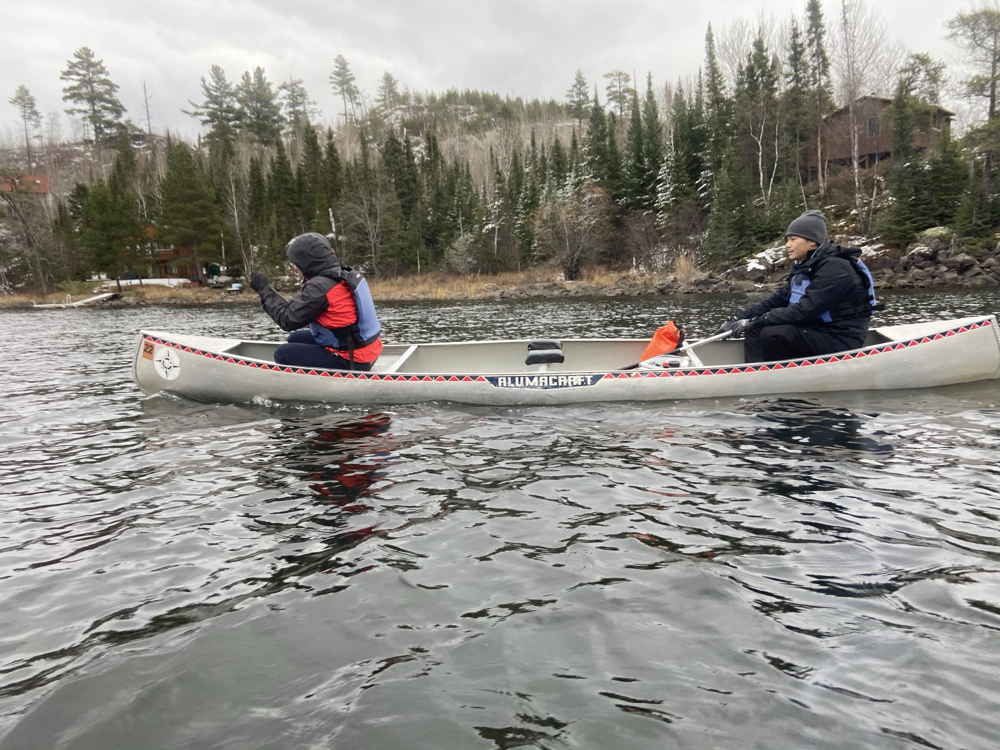

<a href="https://jiyeow.github.io/index.html" rel="noopener noreferrer">Back to main page</a>

---
# Life on the land
### Walking around tress and mountains 

 
   
  
   

### I also like running around with friends in costumes

 
  

### And when I'm tired of walking/running, I enjoy pedaling 

 
  
  

### And..when I'm tired of pedaling, I add a small motor to my bike 

 

# Life on the water
### Scuba diving (technically under water but oh well) 

 

### You can say I'm a fishless fisherman 

  
### Following my friend who allegedly knows where to find the fish 

# Life in the air
### You have to jump out of a perfectly fine plane at least once

  

<a href="https://jiyeow.github.io/index.html" rel="noopener noreferrer">Back to main page</a>
